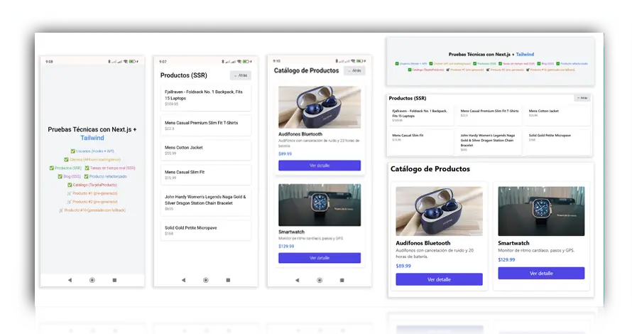

# 🚀 Next.js Multifetch Demo


---

## 🧠 Descripción

Este proyecto es una demostración práctica desarrollada con Next.js, Tailwind CSS y TypeScript. Explora diferentes técnicas de consumo de datos con SSR, SSG, ISR, Hooks personalizados, rutas avanzadas y simulaciones de componentes reales como catálogos, productos, blog y más.

---

## 🌐 Acceso en línea

🔗 [Ver sitio desplegado en Vercel](https://nextjs-multifetch-demo.vercel.app/)

---

## 🛠️ Tecnologías principales

-  Librería base para interfaces interactivas
-  Framework React para SSR/SSG/ISR
-  Estilos utilitarios rápidos
-  Tipado estático
-  Estilos encapsulados
-  Rutas de API integradas en Next.js
-  Optimización de imágenes con Next/Image


---

## 📦 Estructura del proyecto

```bash
pruebas-tecnicas-nextjs/
├── components/          # Tarjetas de producto reutilizables
├── pages/
│   ├── producto/        # Ruta dinámica con SSG + ISR
│   ├── clientes.tsx     # Hooks + carga condicional
│   ├── productos.tsx    # SSR
│   ├── tiempo-real.tsx  # SSR
│   ├── blog.tsx         # SSG
│   ├── usuarios.tsx     # Fetch con Hooks personalizados
│   ├── catalogo.tsx     # Tarjetas dinámicas
│   ├── prueba-refactor.tsx # Refactor con Imagen
├── styles/              # Estilos globales con Tailwind y CSS modules
├── public/              # Recursos estáticos
├── next.config.js       # Configuración de imágenes externas
├── tailwind.config.js   # Configuración de utilidades
├── tsconfig.json        # Configuración de TypeScript
└── README.md
```

---

## 🔃 Endpoints y APIs utilizadas

- `https://jsonplaceholder.typicode.com/users` — Lista de usuarios
- `https://jsonplaceholder.typicode.com/todos` — Tareas en tiempo real
- `https://fakestoreapi.com/products` — Catálogo de productos y detalle dinámico

---

## ✅ Funcionalidades implementadas

| Característica                              | Estado |
|---------------------------------------------|--------|
| SSR para productos y tareas                 | ✅     |
| SSG + ISR para productos dinámicos          | ✅     |
| Rutas dinámicas con `getStaticPaths`        | ✅     |
| Hooks personalizados para manejo de vista   | ✅     |
| Estilos con Tailwind CSS + CSS Modules      | ✅     |
| Imagen con optimización en Next/Image       | ✅     |
| Navegación con botón “← Atrás”              | ✅     |
| Proyecto deployado con Vercel               | ✅     |

---

## 🧪 Cómo probar localmente

```bash
# Clonar el repositorio
git clone https://github.com/dienton82/nextjs-multifetch-demo.git
cd nextjs-multifetch-demo

# Instalar dependencias
npm install

# Ejecutar en modo desarrollo
npm run dev
# Abre: http://localhost:3000
```

---

## 🖼️ Captura



---

## 📄 Licencia

Este proyecto está bajo la licencia MIT.  
© 2025 [dienton82](https://github.com/dienton82)
